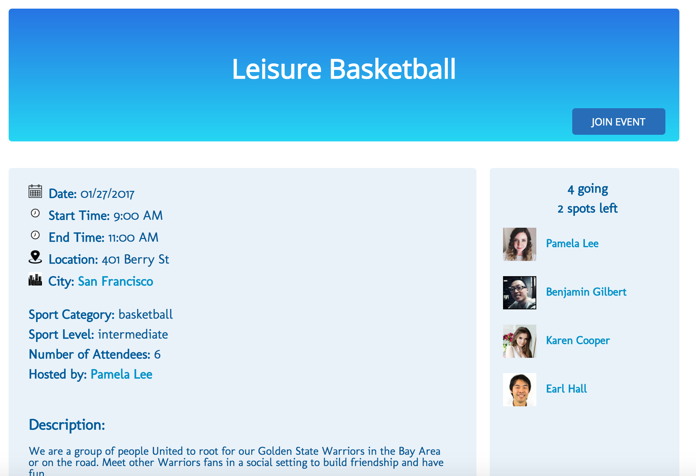
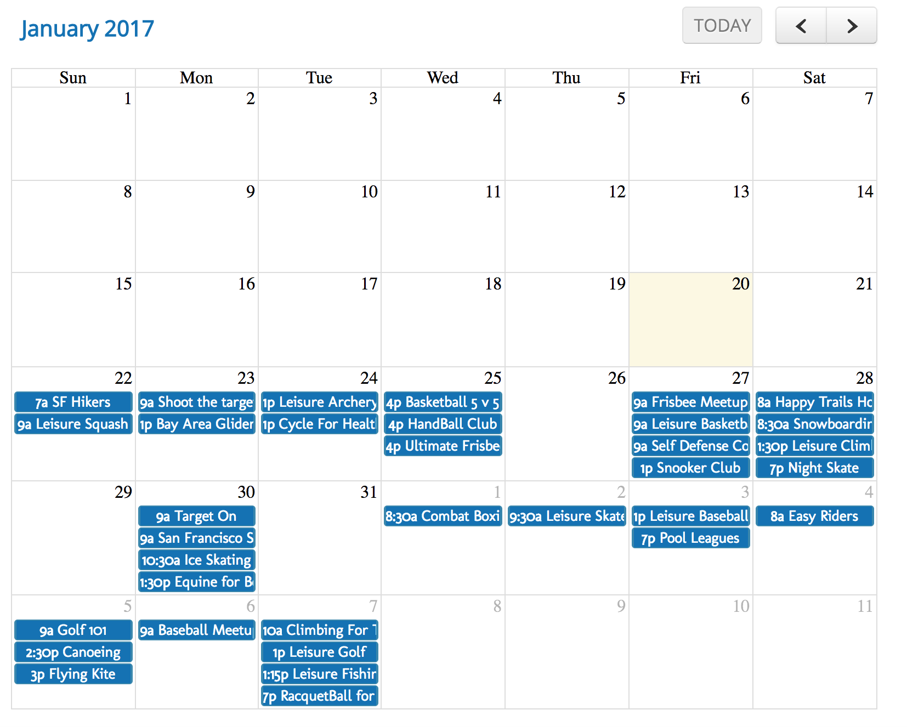

# MeetSport

[Meet Sport](http://meetsport.herokuapp.com)

MeetSport is a full stack web application inspired by Meetup. It utilizes Ruby on Rails on the backend, a PostgreSQL database, and React.js with a Redux architectural framework on the frontend. MeetSport allows users to search and explore for sporting events in the city. Users are able to join the city and events.

## Features & Implementation
### Cities and Joining Cities
On the database side, the cities are stored in single table which contains columns for  `id`, `name`, `background_image_url`, and `header_image`. The relationship between the user and cities are connected through a join memberships table in database. Cities have many users and many events. The cities are held in the `cities` slice of the redux store. List of the cities are rendered into `CityList` and `CityListItem` components. The details of the city are held in the `cityDetail` and `cityEvent` slices of the redux store. Detail of the city is rendered in `City` component. List of the sporting events is rendered in `CityEvent` and `EventListItem` components. The list of all the members in the city is rendered in `CityMember` component. The event creation form is rendered in `EventForm` component.


### Events and RSVPs
On the database side, the information of the events are stored in single table which contains columns for `id`, `city_id`, `name`, `location`, `description`, `start_time`, `end_time`, `date`, `level`, `attendees_num`, and `host_id`. Event has many attendees through the attendees join table, event is belonged to city and event is hosted by user. The event details are held in `eventDetail` slice of the redux store. Details of the event are rendered in `Event` and `EventDetail` components.



### Search by category
On the database side, all the sport categories are stored in single table which contains columns for `name` and `image`. The `event_types` table joined the category table and the events table. The search result are held in `search` slice of the redux store. The search bar on the application page will detect the onChange event and send api request to the backend. In the event controller, the Category table will get the result based on the search params that passed in. The Event table will search for all the events based on the result passed in by category.

```
if params[:search] == ""
  @events = []
else
  keyword = "#{params[:search]}%"
  category_id = Category.where("name LIKE ?", keyword).map{ |el| el.id }
  event_id = EventType.where("category_id IN (?)", category_id).map{ |el| el.event_id }
  @events = Event.where("id IN (?)", event_id)
end

render: index
```

### Calendar on city page
The event details of the city are held in the `cityDetail` slice of the redux store. The events calendar is rendered in `CityCalendar` component. `CityCalendar` uses the jQuery plugin `FullCalendar` to deploy the events details into the calendar view.



### User profile
In the database, the information of the users are stored in single table which contains columns for `id`, `username`, `password_digest`, `session_token`, `name`, `created_at`, `profile_img`, `about_me`. Users could join many cities and events. The user information are held in the `userDetail` slice of the redux store. The current user's profile is rendered in `User`, `UserHostEvent`, `UserJoinEvent` and `UserEdit` components. The other user profiles are rendered in `OtherUser`, `OtherUserHostEvent`, `UserJoinEvent` components.


## Future Directions for the Project
In addition to the features already implemented, I plan to continue to add more features and polish my application. The next steps for MeetSports are outlined below.

### User able to update and delete events
I plan to add an update and delete button to the current user's hosted event

### Comments on events
I plan to add comment features so that users able to communicate through the feature.

### Map for the events
I plan to add Google Map to show all the location of the events in the city.
